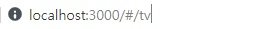
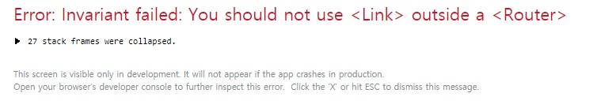
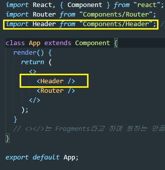
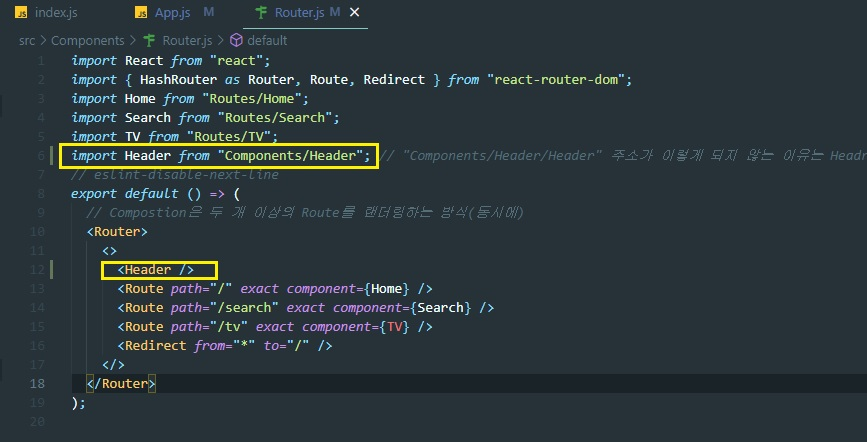

# myflix

> React와 ES6를 이용한 넷플릭스 클론코딩

## Pages

- [ ] Home
- [ ] Deatil
- [ ] TV
- [ ] Search

## API Verbs

- [x] Now Playing(Movies)
- [x] Upcomming(Moives)
- [x] Popular(TV, Moives)
- [x] Top Rated(TV)
- [x] Airing Today(TV)
- [x] Tv Show Deatail
- [x] Moive Deatail
- [x] Search(TV, Movies)

## 1.0 사용한 도구

- React Router : 간단한 컴포넌트 묶음, React에게 시작 라우터 지정가능
- [themoviedb](https://www.themoviedb.org/) : 영화 데이터를 받아올 수 있는 API
- Api에서 제공하는 append_to_response: 영화나 TV의 포스터나 예고편을 제공해줌
- Axios : request 작업하기 위함과 api의 데이터를 받아오기 위해 사용

## 2.0 새로 학습한 내용

> 사진의 주소에 #이 있는것은 Hash Router(앱처럼 보이게) 방식이다.  
> #이 없는 것은 Browser Router이며 HTML history API(웹처럼 보이게)라는 것을 사용한다.  
> 

## 3.0 Error

### 3.1 Link outside a Router 에러

> src/Components/Header.js에서  
> import { Link } from "react-router-dom"; 사용을 했을 때 발생한 에러  
> 
>
> Link를 사용하려면 Router 안에서 사용해야하기에 import를 Router.js에서 해주는 방식으로 해결  
>   
> 
